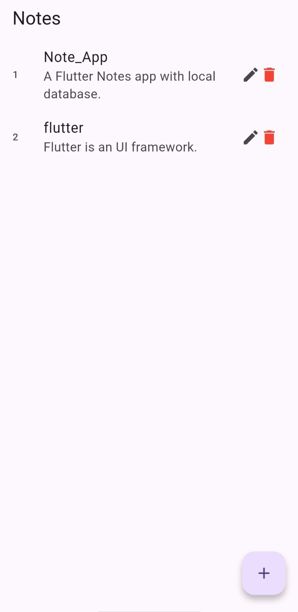
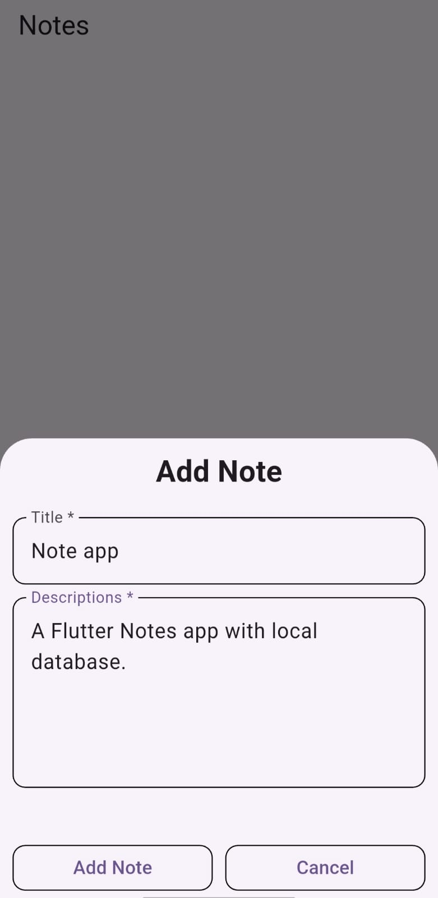
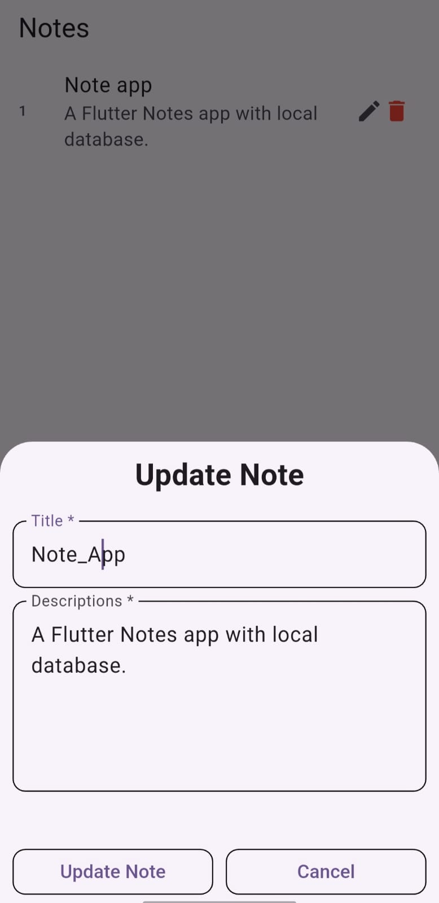

#  📝 Note App

A **Flutter Notes Application** with local database support using **SQLite**.  
Create, edit, and manage your daily notes with a smooth and clean user experience.


## ✨ Features

✅ Add Notes  
✅ Edit Existing Notes  
✅ Delete Notes  
✅ Local Storage with SQLite  


## 📱 Screenshots

<p align="center">
  
  
  
  
</p>


## 🚀 Tech Stack

Technology:
Flutter
Dart 
SQLite


## 📂 Project Structure

```bash
lib/
 ┣ data/
 ┃ ┗ local/
 ┃    ┗ db_helper.dart
 ┣ home_page.dart
 ┗ main.dart
```

## ⚡ Installation

```bash
git clone https://github.com/shivamsingh-22/Note_App.git
cd Note_App
flutter pub get
flutter run
```

## 🔗 GitHub Repository

🔗 GitHub:  
https://github.com/shivamsingh-22/Note_App
